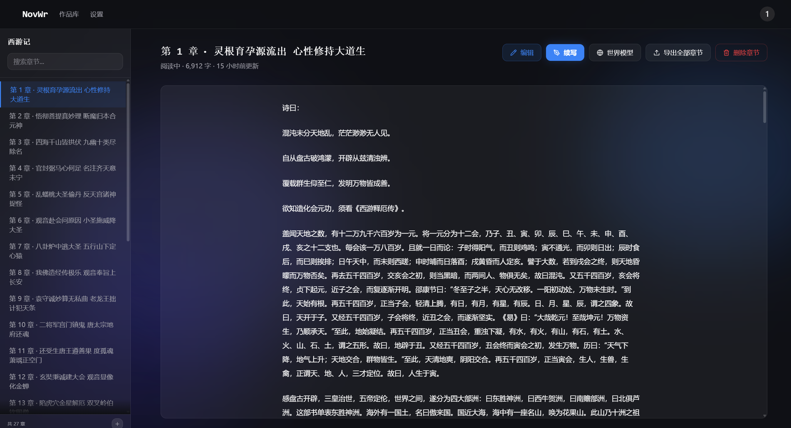

# NovelWriter

让创意变得廉价——在持久化的世界模型中自由生成、丢弃、打磨你的小说。

NovelWriter 是一个 AI 辅助小说续写工具。它不只是"续写下一段"，而是维护一个完整的世界模型（人物、关系、体系），让 AI 真正理解你的故事世界，生成风格一致、逻辑自洽的续写内容。



## 核心特性

- **世界模型驱动续写** — 实体、关系、体系构成知识图谱，AI 续写时自动注入相关上下文，而非盲目续写
- **流式生成** — 逐字输出，所见即所得
- **多版本对比** — 一次生成多个续写方案，挑选最满意的
- **Bootstrap 管线** — 导入已有小说文本，自动提取世界模型（人物、关系、势力、体系）
- **Worldpack 导入/导出** — 世界观设定可打包分享，一键导入
- **世界模型编辑器** — 可视化编辑实体、关系图、层级体系，完全掌控世界观
- **叙事约束** — 定义体系级规则（如"禁用现代心理描写"），AI 严格遵守
- **BYOK (Bring Your Own Key)** — 自部署模式下使用你自己的 LLM API，支持任何 OpenAI 兼容接口

## 快速开始

### Docker 部署（推荐）

```bash
git clone https://github.com/YOUR_USERNAME/NovelWriter.git
cd NovelWriter
cp .env.example .env
# 编辑 .env，填入你的 LLM API 配置
docker compose up -d
```

打开浏览器访问 `http://localhost:8000`。

### 本地开发

**后端**

```bash
python -m venv .venv
source .venv/bin/activate
pip install -r requirements.txt
cp .env.example .env
# 编辑 .env
uvicorn app.main:app --reload --port 8000
```

**前端**

```bash
cd web
npm install
npm run dev
```

前端开发服务器默认运行在 `http://localhost:5173`。

## 环境变量

| 变量 | 必填 | 说明 |
|------|------|------|
| `OPENAI_API_KEY` | 是 | LLM API 密钥 |
| `OPENAI_BASE_URL` | 否 | API 地址（默认 OpenAI，可改为任何兼容接口） |
| `OPENAI_MODEL` | 否 | 模型名称 |
| `JWT_SECRET_KEY` | 生产环境必填 | JWT 签名密钥，请使用随机长字符串 |
| `DATABASE_URL` | 否 | 数据库地址（默认 SQLite） |

完整配置见 [`.env.example`](.env.example)。

## 技术栈

| 层 | 技术 |
|----|------|
| 后端 | FastAPI · SQLAlchemy · SQLite/PostgreSQL |
| 前端 | React 19 · TypeScript · Tailwind CSS · React Query |
| AI 集成 | OpenAI 兼容 API（支持 OpenAI / Gemini / DeepSeek 等） |
| 部署 | Docker · docker-compose |

## 项目结构

```
app/              # FastAPI 后端
  api/            # 路由层
  core/           # 业务逻辑（生成、上下文组装、Bootstrap）
  models.py       # SQLAlchemy 数据模型
  config.py       # 配置管理
web/              # React 前端
  src/pages/      # 页面组件
  src/components/ # UI 组件
data/             # 数据文件（Worldpack、演示数据）
tests/            # 后端测试
scripts/          # 工具脚本
```

## 贡献

欢迎贡献！请先开 Issue 讨论你的想法，然后提交 PR。

```bash
# 运行后端测试
source .venv/bin/activate
scripts/uv_run.sh pytest tests/

# 运行前端测试
cd web && npm run test:run
```

## 许可证

本项目基于 [AGPLv3](LICENSE) 许可证开源。
