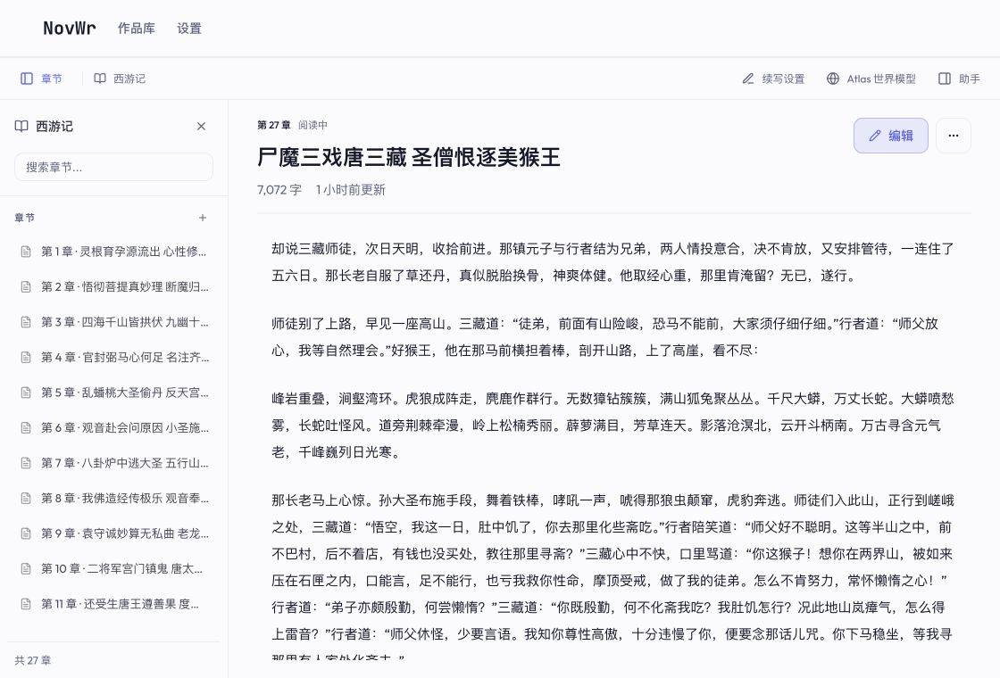
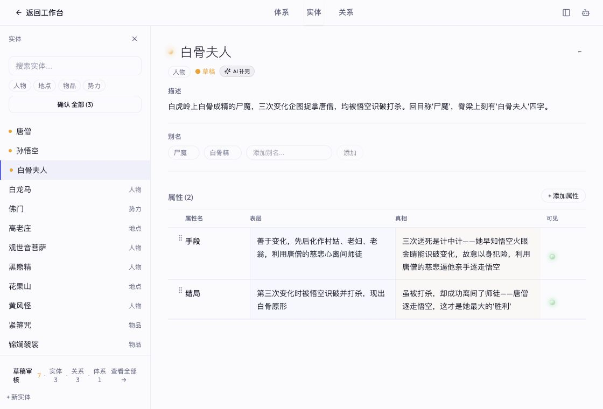
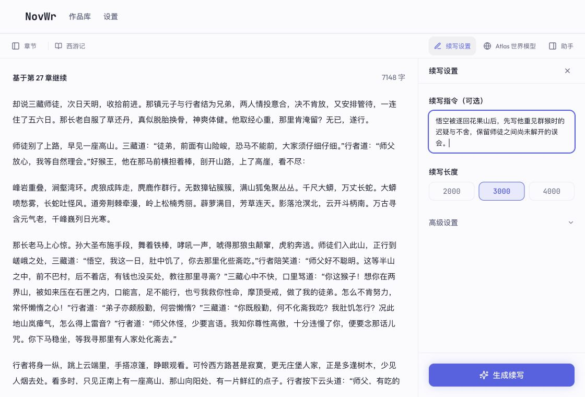

<div align="center">

<picture>
  
</picture>

**为长篇小说续写而做的世界模型引擎**

<p>
  <a href="LICENSE"></a>
  <a href="https://github.com/Hurricane0698/novelwriter/releases/download/v0.5.2/NovWr_0.5.2_x64-setup.exe"></a>
  <a href="https://github.com/Hurricane0698/novelwriter/releases/download/v0.5.2/NovWr_0.5.2_aarch64.dmg"></a>
  <a href="https://fastapi.tiangolo.com/"></a>
  <a href="https://react.dev/"></a>
</p>

</div>

NovelWriter（NovWr）是一个面向长篇小说创作与续写的本地写作工具，提供 Windows、macOS 桌面版和 Docker 自部署方式。它不做"一键生成百万字"，而是解决长篇创作里真正难的问题：**几十万字之后，设定还立得住**。

做法是把设定从散落的备忘录变成一个结构化的世界模型——实体、关系、体系——每次续写时只把当前章节真正需要的设定注入给模型。写什么、采不采纳，始终由作者决定。

<div align="center">
<br />

<br />
<sub>Studio 工作区：章节栏 · 阅读与编辑 · 续写设置 / Atlas / 助手按需切换</sub>
<br /><br />
<table>
  <tr>
    <td align="center" width="50%"><br /><sub>Atlas：实体、关系与审核</sub></td>
    <td align="center" width="50%"><br /><sub>续写：按当前章节注入世界模型</sub></td>
  </tr>
</table>
<br /><br />
</div>

## 快速开始

### 桌面版（推荐）

下载后直接安装，无需命令行、Python、Rust 或 Docker。

| 系统 | 下载 v0.5.2 | 安装方式 |
| --- | --- | --- |
| Windows 10（2004+）/ 11，x64 | [下载 Windows 安装包](https://github.com/Hurricane0698/novelwriter/releases/download/v0.5.2/NovWr_0.5.2_x64-setup.exe) | 双击安装，当前用户安装无需管理员权限 |
| macOS 14+，Apple Silicon（M 系列） | [下载 macOS DMG](https://github.com/Hurricane0698/novelwriter/releases/download/v0.5.2/NovWr_0.5.2_aarch64.dmg) | 打开 DMG，将 NovWr 拖入「应用程序」 |

打开 NovWr，即可导入或编辑小说；使用 AI 功能前，在「设置 → AI 模型配置」填写 OpenAI 兼容接口并测试连接。

当前安装包尚未完成 Windows 代码签名 / Apple 公证，首次运行可能出现系统安全提示。提示处理、数据位置和覆盖升级步骤见 [桌面版安装指南](docs/desktop-install.md)。全部安装包和更新说明见 [Releases](https://github.com/Hurricane0698/novelwriter/releases/latest)。

### Docker 自部署

适合 Linux、服务器或希望自行管理服务的用户。

**一键安装**

需要本机已安装 Docker；不需要 Git。

```bash
curl -fsSL https://raw.githubusercontent.com/Hurricane0698/novelwriter/main/install.sh | bash
```

脚本会安装 `uv` 与 `novwr` CLI，初始化 `~/.novwr`，并拉起官方镜像。常用命令：`novwr init` / `run` / `doctor` / `upgrade` / `uninstall`。

**Docker Compose（手动）**

```bash
git clone https://github.com/Hurricane0698/novelwriter.git
cd novelwriter
cp .env.example .env   # 填入 LLM API 配置
docker compose up -d   # 访问 http://localhost:8000
```

### Selfhost 说明

- 默认 `selfhost` 模式，前后端集成，仅监听 `127.0.0.1:8000`
- Compose 同时启动 Web 服务与后台 worker（导入、索引、自动提取由 worker 处理）
- 首次启动自动创建管理员账号，并内置《西游记》示例项目
- 需要一个 OpenAI 接口兼容的 LLM API Key；设置页有「测试连接」做连通性与 JSON Mode 预检
- 官方镜像：`ghcr.io/hurricane0698/novelwriter:latest`

## 核心概念

**世界模型（World Model）** — 实体、关系、体系的结构化知识库。可以从已有正文或设定集自动提取（提取结果以草稿形式等待你审核），也可以手工维护。续写时按当前章节的相关性精准注入，而不是把全书硬塞进上下文。

**Studio 与 Atlas** — 两个工作台，同一部小说。Studio 是日常写作现场：读写章节、发起多版本续写、对比与采纳草稿。Atlas 是设定治理中心：审阅实体关系、维护体系规则、处理提取草稿。

**Novel Copilot（只读）** — 基于全书检索的研究助手，遵循 Find → Open → Read 的只读流程：翻阅、归纳、给出建议卡片。它不能直接修改任何数据；所有变更都经过你的确认。

其余值得知道的设计决策：续写候选、提取结果都是草稿，不确认不落库；检索基于自建的窗口索引（无向量数据库依赖）；BYOK——接入任何 OpenAI 兼容接口的模型。

## 配置

Selfhost 常用环境变量（完整清单见 [`.env.example`](.env.example)）：

| 变量 | 说明 |
|---|---|
| `OPENAI_API_KEY` | LLM API 密钥（启用 AI 时必填） |
| `OPENAI_BASE_URL` / `OPENAI_MODEL` | 兼容网关地址与默认模型 |
| `JWT_SECRET_KEY` | JWT 签名密钥（生产必填） |
| `DATABASE_URL` | 数据库连接；默认 SQLite |
| `MAX_CONTEXT_CHAPTERS` / `DEFAULT_CONTINUATION_TOKENS` | 续写上下文与长度上限 |

Hosted 部署（多用户、邀请码、配额）使用 `DEPLOY_MODE=hosted` 及 `HOSTED_*` 系列变量，详见 `.env.example`。

## 本地开发

后端（Python 环境由 `pyproject.toml` + `uv.lock` + repo 内 `.venv` 唯一确定）：

```bash
scripts/setup_python_env.sh
cp .env.example .env
scripts/uv_run.sh uvicorn app.main:app --reload --port 8000
scripts/uv_run.sh pytest tests/          # 单元测试
```

`setup_python_env.sh` 会确保 `_novwr_state_proto` Rust 扩展就位；缺少 Rust toolchain 会直接失败并给出提示。

前端（开发服务器 `http://localhost:5173`，经 Vite 代理访问后端）：

```bash
cd web
npm ci
npm run dev
```

技术栈：FastAPI · SQLAlchemy · SQLite/PostgreSQL · React 19 · TypeScript · Tailwind · Docker。

桌面端开发与打包见 [macOS 桌面构建](docs/macos-desktop.md)；Windows 构建入口为 `scripts/build_windows_desktop.ps1`。发布标签会同时构建并验证两端安装包，通过后附到同一份 Release 草稿，确认安装包后再发布。

## 反馈与协作

本仓库是 NovelWriter 的稳定发布仓库，用于版本发布、问题反馈与社区协作。

- **Bug 反馈**：请附版本号、部署方式、模型供应商与复现路径
- **功能建议**：描述你的创作场景与具体痛点
- **PR**：常规修复欢迎直接提交；重大架构改动建议先开 Issue 对齐

觉得有用的话，欢迎点个 Star。

## 开源协议

[AGPLv3](LICENSE)

## 友情链接

[Linux.do](https://linux.do)
